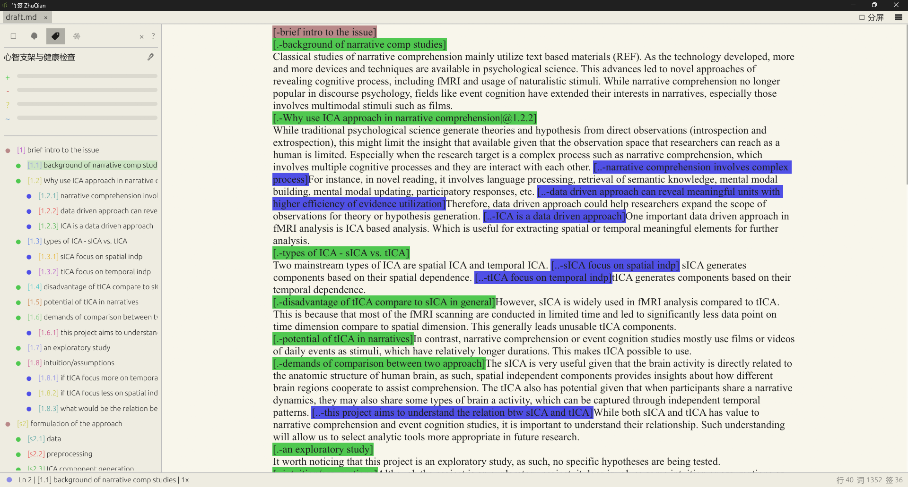

# 竹签 · ZhuQian

[简体中文] | [English](./README_en.md)

**胸有“竹”，心有“签”**

一款用 **Rust** 与 **eframe / egui** 编写的**结构化写作与逻辑建模工具**。它基于 [Semout (语义大纲)](./semout/README_zh.md) 标准构建，支持拖拽式重组、逻辑可视化与模版引导。

> **“竹签”**之名，取自**“胸有成竹”**之意与**“标签”**之形。旨在通过语义化标签，辅助作者在写作过程中梳理逻辑脉络。



## 核心特性

### 1. 结构化写作与 DND 拖放
- **语义大纲**：通过 `[1.2.1]` 样式的语义标签，实时构建文档骨架。
- **块状挪动**：在大纲中直接通过拖拽 (Drag & Drop) 来重组章节顺序或嵌套关系，正文内容同步完成物理搬运。
- **自动索引**：支持显式路径（如 `[s1.1]`）与相对路径（如 `[.1]`），嵌套移动时自动重算标识符。

### 2. 逻辑拓扑可视化 (Logic Topology)
- **关系建模**：支持通过 `|` 操作符建立标签间的逻辑关联。
- **动态连线**：在大纲侧边栏实时呈现逻辑流向图，让隐性的叙事脉络可视化。

### 3. 模版引导与 Ghost Outline
- **结构约束**：通过 `.zqt` 模版定义文章的“预期骨架”。
- **占位引导**：在大纲中以虚影形式展示模版要求，引导作者完成各个功能性模块的填充。

### 4. 沉浸式布局 (Zen Mode)
- **居中编辑**：支持画布居中的 Zen Mode，减少视觉干扰。
- **渲染性能**：基于 Rust 的原生绘图系统，在长文档下保持平滑的滚动与即时高亮。
- **布局优化**：侧边栏采用无省略号硬截断渲染，在有限空间内展示更多层级信息。

### 5. 多端一致性架构
- **zq-core**：核心解析与逻辑引擎，确保桌面端与 VSCode 插件端在语义识别、主题渲染上保持 100% 同步。

## 快速上手

### 环境要求
- 已安装 [Rust](https://www.rust-lang.org/tools/install) 工具链（`rustc`、`cargo`）。

### 构建与运行
```bash
# 1. 编译并运行
cargo run --package zhuqian

# 2. 生成 release 版本 (.exe)
cargo build --release
# 产物位于: target/release/zhuqian.exe
```

## 快捷键

| 快捷键 | 作用 |
|:---|:---|
| `Ctrl + S` | 保存当前文件 |
| `Ctrl + Shift + C` | 纯净复制（不带语义标签） |
| `Ctrl + T` | 切换逻辑拓扑图显示 |

## 项目结构

| 路径 | 说明 |
|:---|:---|
| `zq-core/` | 跨平台共享解析引擎（Rust） |
| `zq-desktop/` | 基于 egui 的原生桌面客户端 |
| `semout/` | 竹签语义大纲协议规范 |
| `docs/` | 项目文档与[文件标准定义](./docs/zh/FILE_STANDARD.md) |

---
*竹签：基于语义标签的结构化写作。*
